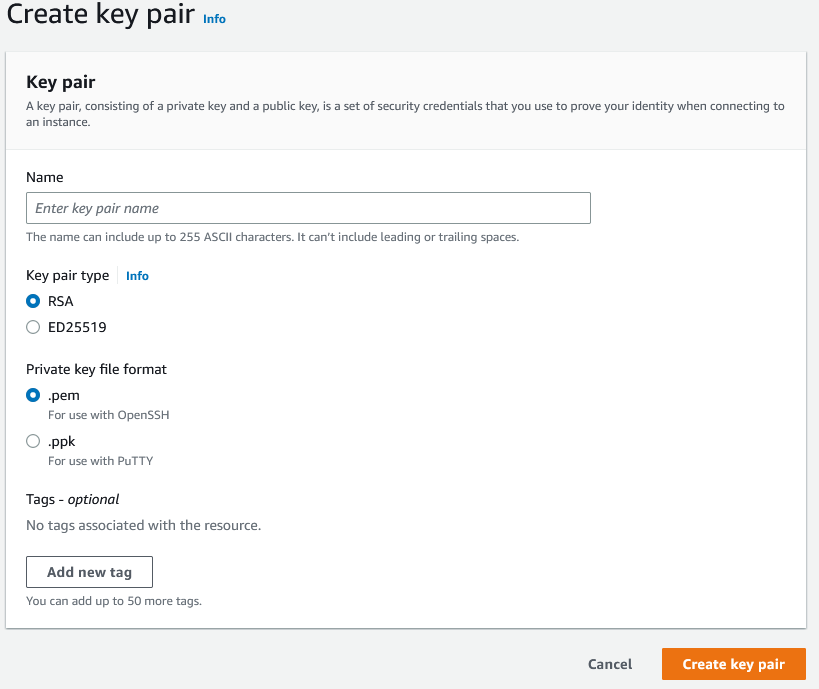
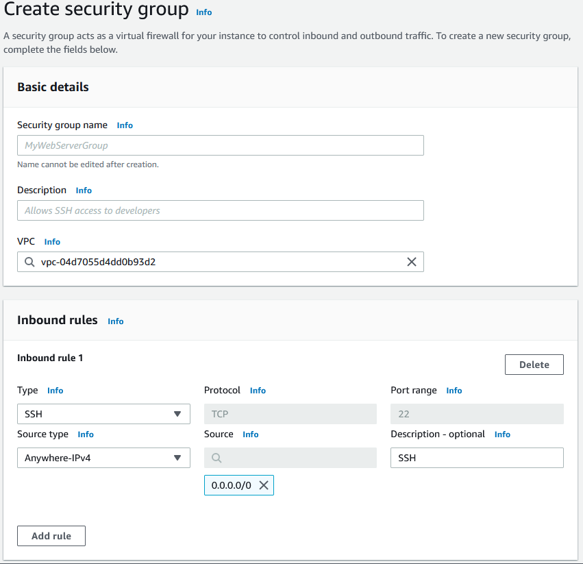
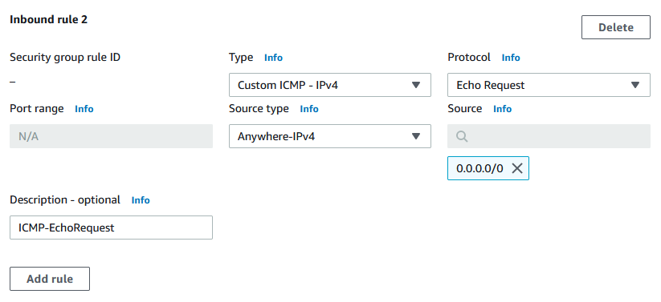
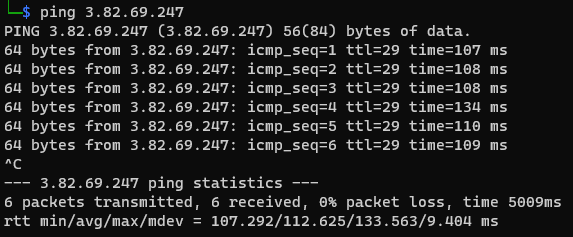

# HEIG_CLD_Labo1

**Group U : A. David, T.Van Hove**


## Table of contents

[TOC]


## Introduction

This document describes the successive steps necessary to successfully complete laboratory #1 of the CLD course. It will also allow our group to answer the various questions asked in the lab instructions.

The objectives of this lab is to gain experience with an Infrastructure-as-a-Service. We are going to use  AWS to create a service from scratch and measure its performance and resource consumption. Finally we will estimate the price tag of such a service using AWS.

## Part 1 & 2 : Setting up a virtual server

In this part, we are going to configure and launch a virtual ubuntu server with Amazon Elastic Compute Cloud (Amazon EC2). 

### Creating key pairs

To later connect to our instance with SSH, we need to generate a key pair for the authentication. Here's how to proceed:

1. From the left menu on the EC2 dashboard, go to to `Network & Security` -> `Key Pairs`.
2. Click on `Create key pair` on the top right corner.
3. Select RSA or ED25519 encryption
   1. Note that ED25519 work only with **mac or linux instances**
4. Depending on the SSH client on your local machine:
   1. With OpenSSH select .pem file
   2. With PuTTY select .ppk file
5. Click on `Create key pair`.



The private key file will automatically be downloaded in you browser.

If you are using a linux/mac OS on your local machine, yo will need do change the access rights of the key file:

```bash
chmod 400 yourFileName.pem
```

### Setting up the security groups

We will set the security group to allow any incoming SSH connection.

1. From the left menu on the EC2 dashboard, go to to `Network & Security` -> `Security groups`.
2. Click on `Create security group` on the top right corner.
3. Type a name and eventually a description for the security group.
4. Add an inbound rule by clicking on the `Add rule` button.
5. Select `SSH` from the `Type` drop down menu.
6. Select `Anywhere-IPv4` from the `Source type` drop down menu.
7. Add an optional description
8. Click on the `Add rule` button.
9. Click on `Create security group` button on the bottom right of the page.



Now we have the 2 mandatory components to create and access our future instance.

### Create and launch an Amazon EC2 instance

Now we will create our instance.

1. From the left menu on the EC2 dashboard, go to to `Instances` -> `Instances`.

2. Click on `Launch instances` on the top right corner.

3. Give a name to your instance

4. Select the OS image you want to use (In this context we'll be using ubuntu).

5. Select the version of the specific image you want in the drop down menu (ubuntu Server LTS 18.04 SSD Volume type)

6. Select the CPU architecture of you OS from the drop down menu

7. You can choose the instance type from the drop down menu. It will define the performance level of the virtualized instance with more or less CPU threads, memory and network performance. In this context we are using the t2.micro instance type :
   |   Type   | vCPU | Architecture | Memory | Network perf |
   | :------: | :--: | :----------: | :----: | :----------: |
   | t2.micro |  1   |    x86_64    |  1 GB  | Low/Moderate |

8. In the Key pair section, select the Key pair you configured [previously](#Creating-key-pairs) from the drop down list.

9. In the Network settings section, select the existing security group you configured [previously](#Setting-up-the-security-groups) from the drop down list

10. You can configure the number of volumes, the amount and type of storage memory you want to use in the `Configure storage` section. We have chosen 8GB general purpose SSD (gp2) that was selected by default.

11. It is possible to configure advanced parameters such as shutdown behaviour, or credit specification. We left this section configures by default.

12. Finally, click on the  `Launch instance` button at the bottom of the page

Note: the instance will quickly start (within few seconds), however, when the instance has started for the first time, some status check will be performed. During those check, it is possible to be unable to connect to your instance with SSH. In this case, just wait until the status checks are passed.

### Connection to the running instance

Once the instance is running it is possible to connect to it with SSH. In the terminal type the following command:

```bash
ssh -i /path/key-pair-name.pem instance-user-name@instance-public-dns-name
```

In our case :

```bash
ssh -i GrU_VanHove.pem ubuntu@ec2-54-235-226-53.compute-1.amazonaws.com
```

Then, the following prompt will be displayed:
```
The authenticity of host 'ec2-54-235-226-53.compute-1.amazonaws.com (198-51-100-1)' can't be established.
ECDSA key fingerprint is l4UB/neBad9tvkgJf1QZWxheQmR59WgrgzEimCG6kZY.
Are you sure you want to continue connecting (yes/no)?
```

Just type `yes`, then the connection will be established. This message warns you that the authenticity of the host is not verified. If you really want to be sure not to be the target of a MITM attack, you can compare the displayed key fingerprint with the help of this [documentation.](https://docs.aws.amazon.com/AWSEC2/latest/UserGuide/connection-prereqs.html#connection-prereqs-fingerprint)

**Troubleshooting**

In case of error, you can read this [troubleshooting guide](https://docs.aws.amazon.com/AWSEC2/latest/UserGuide/TroubleshootingInstancesConnecting.html).

### Questions

**1 What is the smallest and the biggest instance type (in terms of virtual CPUs and memory) that you can choose from when creating an instance?**

There are 624 different type of instances. From all of those we found the u-24tb1.112xlarge that allows 448 virtual CPUs with 24576 GB or memory and a 100 Gigabit speed network capabilities. The pricing is 218.4$ per hour.

**2 How long did it take for the new instance to get into the *running* state?**

Approximatively 10 seconds. However, we must wait approx. 3-5 minutes for the check tests to be passed.

**3 From the EC2 Management Console copy the public DNS name of the instance into the report.**

ec2-3-83-165-119.compute-1.amazonaws.com

**4 What's the difference between time here in Switzerland and the time set on the machine?**

The time on the instance is set to UTC but here we are using UTC + 1 so  the instance time is 1 hour early.

**5 What's the name of the hypervisor?**

I our case Xen. We found it with the command `lscpu` that displays information about the CPU architecture.

```
Architecture:        x86_64
CPU op-mode(s):      32-bit, 64-bit
Byte Order:          Little Endian
CPU(s):              1
On-line CPU(s) list: 0
Thread(s) per core:  1
Core(s) per socket:  1
Socket(s):           1
NUMA node(s):        1
Vendor ID:           GenuineIntel
CPU family:          6
Model:               63
Model name:          Intel(R) Xeon(R) CPU E5-2676 v3 @ 2.40GHz
Stepping:            2
CPU MHz:             2399.776
BogoMIPS:            4799.99
Hypervisor vendor:   Xen
Virtualization type: full
L1d cache:           32K
L1i cache:           32K
L2 cache:            256K
L3 cache:            30720K
```

Otherwise, Amazon Nitro System for the newest EC2 infrastructure [Source](https://aws.amazon.com/fr/ec2/nitro/).

**6 How much free space does the disk have?**

With the `lsblk` (list block devices) command we can view the information about all available block devices. In our case 7.9 GB:

```
xvda     202:0    0    8G  0 disk
├─xvda1  202:1    0  7.9G  0 part /
├─xvda14 202:14   0    4M  0 part
└─xvda15 202:15   0  106M  0 part /boot/efi
```

**(Going further) How much free system memory does the image have?**

With the `free -h` command we can see that we have 292MB of free memory.

|        | total | used  | free  | shared | buff/cache | available |
| ------ | ----- | ----- | ----- | ------ | ---------- | --------- |
| Memory | 974MB | 129MB | 292MB | 792kB  | 551MB      | 677MB     |
| Swap   | 0B    | 0B    | 0B    |        |            |           |

**7 Trying to ping the instance**

To reach our instance we must use the Public IPv4 address displayed in the Instance summary. With the current security policies we cannot ping the instance because we do not allow ICMP echo request. For doing it, we must modify our security policies as follow:

1. On the security group you previously created, click on "Edit inbound rules"

2. Then add an inbound rule (click on Add rule)

3. Select `Custom ICMP - IPv4` from the `Type` drop down menu.

4. Select `Echo Request` from the `Protocol` drop down menu

5. Select `Anywhere-IPv4` from the `Source type` drop down menu.

6. Finally click on `Save rules` button.

   

   

Now it is possible to ping our local machine with the public IPv4 address:



**8 Network interface of the instance**

If we type the `ifconfig` command, we can see that the OS sees an `eth0` interface with the following ip address: `172.31.82.15`. This address is in the private network range, used for local communications.

But why our instance does not see the same ip address as the public one we used to ping it? Well, each machine inside the datacentre has a private address, not accessible from the outside. It is the datacentre routers job to route every ingoing or outgoing packets. That's why we have 2 different addresses : one for the local network and a public one that can be accessed from outside the local network.

## Part 3 : Install a web application

## Part 4 : Create volumes and use snapshots

## Part 5 : Performance analysis

## Part 6 : Resource consumption and pricing

## Conclusion


