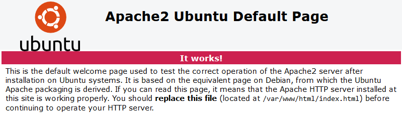
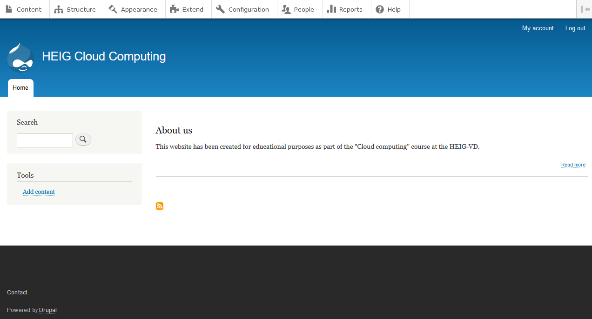
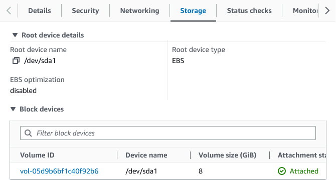
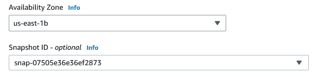
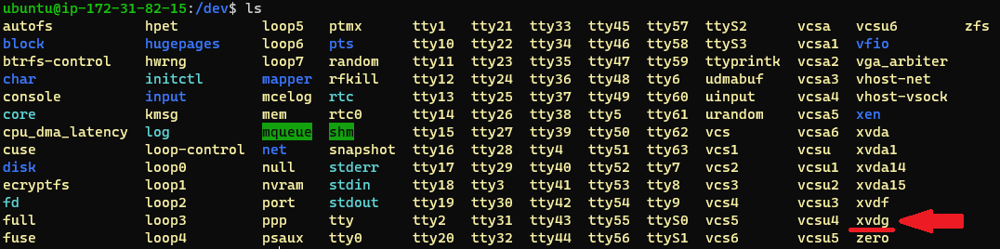
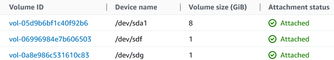
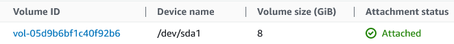

# HEIG_CLD_Labo1

**Group U : A. David, T.Van Hove**

------


## Table of contents

[TOC]

------


## Introduction

This document describes the successive steps necessary to successfully complete laboratory #1 of the CLD course. It will also allow our group to answer the various questions asked in the lab instructions.

The objectives of this lab is to gain experience with an Infrastructure-as-a-Service. We are going to use  AWS to create a service from scratch and measure its performance and resource consumption. Finally we will estimate the price tag of such a service using AWS.

------


## Part 1 & 2 : Setting up a virtual server

In this part, we are going to configure and launch a virtual ubuntu server with Amazon Elastic Compute Cloud (Amazon EC2). 

### Creating key pairs

To later connect to our instance with SSH, we need to generate a key pair for the authentication. Here's how to proceed:

1. From the left menu on the EC2 dashboard, go to to `Network & Security` -> `Key Pairs`.
2. Click on `Create key pair` on the top right corner.
3. Select RSA or ED25519 encryption
   1. Note that ED25519 work only with **mac or linux instances**
4. Depending on the SSH client on your local machine:
   1. With OpenSSH select .pem file
   2. With PuTTY select .ppk file
5. Click on `Create key pair`.


The private key file will automatically be downloaded in you browser.

If you are using a linux/mac OS on your local machine, yo will need do change the access rights of the key file:

```bash
chmod 400 yourFileName.pem
```

### Setting up the security groups

We will set the security group to allow any incoming SSH connection.

1. From the left menu on the EC2 dashboard, go to to `Network & Security` -> `Security groups`.
2. Click on `Create security group` on the top right corner.
3. Type a name and eventually a description for the security group.
4. Add an inbound rule by clicking on the `Add rule` button.
5. Select `SSH` from the `Type` drop down menu.
6. Select `Anywhere-IPv4` from the `Source type` drop down menu.
7. Add an optional description
8. Click on the `Add rule` button.
9. Click on `Create security group` button on the bottom right of the page.


Now we have the 2 mandatory components to create and access our future instance.

### Create and launch an Amazon EC2 instance

Now we will create our instance.

1. From the left menu on the EC2 dashboard, go to to `Instances` -> `Instances`.

2. Click on `Launch instances` on the top right corner.

3. Give a name to your instance

4. Select the OS image you want to use (In this context we'll be using ubuntu).

5. Select the version of the specific image you want in the drop down menu (ubuntu Server LTS 18.04 SSD Volume type)

6. Select the CPU architecture of you OS from the drop down menu

7. You can choose the instance type from the drop down menu. It will define the performance level of the virtualized instance with more or less CPU threads, memory and network performance. In this context we are using the t2.micro instance type :
   |   Type   | vCPU | Architecture | Memory | Network perf |
   | :------: | :--: | :----------: | :----: | :----------: |
   | t2.micro |  1   |    x86_64    |  1 GB  | Low/Moderate |

8. In the Key pair section, select the Key pair you configured [previously](#Creating-key-pairs) from the drop down list.

9. In the Network settings section, select the existing security group you configured [previously](#Setting-up-the-security-groups) from the drop down list

10. You can configure the number of volumes, the amount and type of storage memory you want to use in the `Configure storage` section. We have chosen 8GB general purpose SSD (gp2) that was selected by default.

11. It is possible to configure advanced parameters such as shutdown behaviour, or credit specification. We left this section configures by default.

12. Finally, click on the  `Launch instance` button at the bottom of the page

Note: the instance will quickly start (within few seconds), however, when the instance has started for the first time, some status check will be performed. During those check, it is possible to be unable to connect to your instance with SSH. In this case, just wait until the status checks are passed.

### Connection to the running instance

Once the instance is running it is possible to connect to it with SSH. In the terminal type the following command:

```bash
ssh -i /path/key-pair-name.pem instance-user-name@instance-public-dns-name
```

In our case :

```bash
ssh -i GrU_VanHove.pem ubuntu@ec2-54-235-226-53.compute-1.amazonaws.com
```

Then, the following prompt will be displayed:
```
The authenticity of host 'ec2-54-235-226-53.compute-1.amazonaws.com (198-51-100-1)' can't be established.
ECDSA key fingerprint is l4UB/neBad9tvkgJf1QZWxheQmR59WgrgzEimCG6kZY.
Are you sure you want to continue connecting (yes/no)?
```

Just type `yes`, then the connection will be established. This message warns you that the authenticity of the host is not verified. If you really want to be sure not to be the target of a MITM attack, you can compare the displayed key fingerprint with the help of this [documentation.](https://docs.aws.amazon.com/AWSEC2/latest/UserGuide/connection-prereqs.html#connection-prereqs-fingerprint)

**Troubleshooting**

In case of error, you can read this [troubleshooting guide](https://docs.aws.amazon.com/AWSEC2/latest/UserGuide/TroubleshootingInstancesConnecting.html).

### Questions

**1 What is the smallest and the biggest instance type (in terms of virtual CPUs and memory) that you can choose from when creating an instance?**

There are 624 different type of instances. From all of those we found the u-24tb1.112xlarge that allows 448 virtual CPUs with 24576 GB or memory and a 100 Gigabit speed network capabilities. The pricing is 218.4$ per hour.

**2 How long did it take for the new instance to get into the *running* state?**

Approximatively 10 seconds. However, we must wait approx. 3-5 minutes for the check tests to be passed.

**3 From the EC2 Management Console copy the public DNS name of the instance into the report.**

ec2-3-83-165-119.compute-1.amazonaws.com

**4 What's the difference between time here in Switzerland and the time set on the machine?**

The time on the instance is set to UTC but here we are using UTC + 1 so  the instance time is 1 hour early.

**5 What's the name of the hypervisor?**

I our case Xen. We found it with the command `lscpu` that displays information about the CPU architecture.

```
Architecture:        x86_64
CPU op-mode(s):      32-bit, 64-bit
Byte Order:          Little Endian
CPU(s):              1
On-line CPU(s) list: 0
Thread(s) per core:  1
Core(s) per socket:  1
Socket(s):           1
NUMA node(s):        1
Vendor ID:           GenuineIntel
CPU family:          6
Model:               63
Model name:          Intel(R) Xeon(R) CPU E5-2676 v3 @ 2.40GHz
Stepping:            2
CPU MHz:             2399.776
BogoMIPS:            4799.99
Hypervisor vendor:   Xen
Virtualization type: full
L1d cache:           32K
L1i cache:           32K
L2 cache:            256K
L3 cache:            30720K
```

Otherwise, Amazon Nitro System for the newest EC2 infrastructure [Source](https://aws.amazon.com/fr/ec2/nitro/).

**6 How much free space does the disk have?**

With the `lsblk` (list block devices) command we can view the information about all available block devices. In our case 7.9 GB:

```
xvda     202:0    0    8G  0 disk
├─xvda1  202:1    0  7.9G  0 part /
├─xvda14 202:14   0    4M  0 part
└─xvda15 202:15   0  106M  0 part /boot/efi
```

**(Going further) How much free system memory does the image have?**

With the `free -h` command we can see that we have 292MB of free memory.

|        | total | used  | free  | shared | buff/cache | available |
| ------ | ----- | ----- | ----- | ------ | ---------- | --------- |
| Memory | 974MB | 129MB | 292MB | 792kB  | 551MB      | 677MB     |
| Swap   | 0B    | 0B    | 0B    |        |            |           |

**7 Trying to ping the instance**

To reach our instance we must use the Public IPv4 address displayed in the Instance summary. With the current security policies we cannot ping the instance because we do not allow ICMP echo request. For doing it, we must modify our security policies as follow:

1. On the security group you previously created, click on "Edit inbound rules"

2. Then add an inbound rule (click on Add rule)

3. Select `Custom ICMP - IPv4` from the `Type` drop down menu.

4. Select `Echo Request` from the `Protocol` drop down menu

5. Select `Anywhere-IPv4` from the `Source type` drop down menu.

6. Finally click on `Save rules` button.

   

   

Now it is possible to ping our local machine with the public IPv4 address:


**8 Network interface of the instance**

If we type the `ifconfig` command, we can see that the OS sees an `eth0` interface with the following ip address: `172.31.82.15`. This address is in the private network range, used for local communications.

But why our instance does not see the same ip address as the public one we used to ping it? Well, each machine inside the datacentre has a private address, not accessible from the outside. It is the datacentre routers job to route every ingoing or outgoing packets. That's why we have 2 different addresses : one for the local network and a public one that can be accessed from outside the local network.

------


## Part 3 : Install a web application (Drupal)

In this part, we are going to host Drupal on our EC2 instance.

> What is Drupal?
>
> Drupal is a content management software. It's used to make many of the websites and applications used every day. Drupal has standard  features, like easy content authoring, reliable performance, and  excellent security. But what sets it apart is its flexibility;  modularity is one of its core principles. Its tools help you build the  versatile, structured content that dynamic web experiences need. [Source](https://www.drupal.org/about)

### Change the configuration of the security group

Because we are going to serve a web application we need to add `incoming traffic rule for HTTP port 80`. To add a rule follow the same steps [we did previously](#Setting-up-the-security-groups).

Now when we enter the public DNS name of our instance we can see the Apache2 default page.



### Enable clean URL in Apache

> By default, Drupal uses and generates URLs for your site's pages that look like "http://www.example.com/?q=node/83". With so-called clean URLs this would be displayed without the `?q=`  as "http://www.example.com/node/83".
>
> The style of URLs using `?q=` can be hard to read, and may even  prevent some search engines from indexing all the pages of your site. Research suggests this may not be as big of a problem for major search engines as it once was; however, it is worth noting the recommendation from [Google's webmaster guidelines](http://www.google.com/support/webmasters/bin/answer.py?answer=35769) stating:
>
> > If you decide to use dynamic pages (i.e. the URL contains a `?`  character), be aware that not every search engine spider crawls dynamic pages as well as static pages. It helps to keep the parameters short and the number of them few.
>
> [Source](https://www.drupal.org/docs/7/configuring-clean-urls/enable-clean-urls)

To enable clean URL, we must edit the apache config file located in /etc/apache2/apache2.conf :

```bash
sudo nano /etc/apache2/apache2.conf

# In this section
<Directory /var/www/>
    Options Indexes FollowSymLinks
    AllowOverride None # change it to  AllowOverride All
    Require all granted
</Directory>
```

Then type `ctl + x` and `y` to save and close the file.

### Install mandatory packages

First, we need to install [tasksel](https://help.ubuntu.com/community/Tasksel) to our instance. It is a Debian/Ubuntu tool that installs multiple related packages as a coordinated "task" onto the system. For example, instead of going step-by-step and installing each LAMP stack component, you can have tasksel install all the parts of the LAMP stack.

Install tasksel:

```bash
sudo apt install tasksel
```

Install the lamp stack:

```bash
sudo tasksel install lamp-server
```

Install PHP packages

```bash
sudo apt install php7.2-dom php7.2-gd php7.2-xml php7.2-SimpleXML
sudo systemctl restart apache2
```

### Setup the database for Drupal

```bash
sudo mysql_secure_installation
```

Respond as follows:

- Setup VALIDATE PASSWORD plugin: **No**
- Password for root: Invent a password and write it down
- Remove anonymous users: **No**
- Disallow root login remotely: **No**
- Remove test database and access to it: **No**
- Reload privilege tables now: **Yes**

Create the Durpal database in MySQL:

```bash
sudo mysql -u root -p
```

Create a user and a database for Drupal. You can choose any password for this user.
```bash
mysql> CREATE USER 'drupal'@'localhost' IDENTIFIED BY 'CLD_Lab01';
mysql> CREATE DATABASE drupal;
mysql> GRANT ALL PRIVILEGES ON drupal.* TO 'drupal'@'localhost' IDENTIFIED BY 'CLD_Lab01';
mysql> EXIT;
```

### Download and install Drupal

```bash
# Go to /tmp and download drupal from their ftp repository
cd /tmp
wget https://ftp.drupal.org/files/projects/drupal-8.8.2.tar.gz

# Go to /var/www/html and extract what we downloaded
cd /var/www/html
sudo tar xzf /tmp/drupal-8.8.2.tar.gz

# Create a symlink with a shorter name
sudo ln -s drupal-8.8.2 drupal

# Change the ownership of all drupal files to Apache which has the user www-data and group www-data
sudo chown -R www-data:www-data drupal/
```

The set up is done directly in the browser. Now, navigate to the hostname of the EC2 instance with the appended path `/drupal/core/install.php`.

We filled in the installation screens as follows:

- Choose language: **English**
- Select an installation profile: **Standard**
- Requirements review: ignore the warnings about clean URLs and Unicode library and continue
- Database configuration:
  - Database name: **drupal**
  - Database username: **drupal**
  - Database password: the password for the drupal MySQL user you created earlier
- Configure site:
  - Site name: Invent something, say "Cloud Computing at HEIG-VD"
  - Site email address: nobody@example.com
  - Maintenance account username: admin
  - Password: invent a password for the admin user and write it down
  - Default country: Switzerland
  - Default time zone: Zurich
  - Check for updates: uncheck

### Create a new main page

On our Drupal website, create a new web page by clicking on `Add content`, then select `Basic page`.  Chose a page title and write something about the page in the body. Check`Published` under `Text format`. On the right menu click on `Promotion Options` then select `Promoted to front page`. This will make this page the default one when browsing the website. Finally click on `Save`. You must have a similar result:



### Allocate an elastic IP address

A dynamic IP address is assigned to our instance, so the address will change over time, so we need to allocate a dynamic IP address four our website.

> An *Elastic IP address* is a static IPv4 address designed for dynamic cloud computing. An Elastic IP address is allocated to your AWS account, and is yours until you release it. By using an Elastic IP address, you can mask the failure of an instance or software by rapidly remapping the address to another instance in your account. Alternatively, you can specify the Elastic IP address in a DNS record for your domain, so that your domain points to your instance.
>
> #### Elastic IP address basics
>
> The following are the basic characteristics of an Elastic IP address:
>
> - An Elastic IP address is static; it does not change over time.
> - An Elastic IP address is for use in a specific Region only, and cannot be moved to a different Region.
> - An Elastic IP address comes from Amazon's pool of IPv4 addresses, or from a custom IPv4 address pool that you have brought to your AWS account.
> - To use an Elastic IP address, you first allocate one to your account, and then associate it with your instance or a network interface.
> - When you associate an Elastic IP address with an instance, it is also associated with the instance's primary network interface. When you associate an Elastic IP address with a network interface that is attached to an instance, it is also associated with the instance.
>
> [Source](https://docs.aws.amazon.com/AWSEC2/latest/UserGuide/elastic-ip-addresses-eip.html)

To set up an elastic IP, proceed as follow:

1. In the AWS console, on the left panel, under `Network and security` click on `Elastic IPs`.
2. click on the `Allocate New Address` button.
3. On the page, you can create a tag with the key `Name` and as value the name you wan to use (in our case GrU_VanHove).
4. Select the newly created address and click on `Actions` -> `Associate`. Select the your EC2 instance.
5. Try to ping or access the public allocated address. In our case, the public IP is: `34.226.79.126`. So we can access our website from : `http://34.226.79.126/drupal/`.

### Questions

**Why is it a good idea to create an Elastic IP Address for a web site (our web application)?**

By default, AWS assigns a dynamic IP address, so the address will change over time. An Elastic IP address (EIP) provides a static IP address that will not change.

Another advantage of using an EIP is that it can help avoid getting blacklisted. If the IP address assigned to the web server is used by another user for malicious activities, the address may get blacklisted. This can cause emails to be rejected or flagged as spam. With an EIP, we can avoid this issue by quickly associating a new IP address with our web server.

**Why is it not sufficient to hand out as URL for the web site the public DNS name of the instance?**

The public DNS name of an instance is associated with its IP address, which can change whenever the instance is stopped and restarted. This means that if the IP address changes, the DNS name associated with it will also change, and users will no longer be able to access the web site.

Furthermore, when using the public DNS name, we have no control over the DNS record. This means that we cannot configure SSL certificates, subdomains or other DNS features, which may be necessary for our web site.

------


## Part 4 : Create volumes and use snapshots

In this part we are going to assume that our Drupal site has run out of disk space. To mitigate the problem, we are going to create an additional virtual disk and attach it to the virtual machine.

In the EC2 dashboard, in our instance summary, on the `Storage tab` we can see that our root device is `/dev/sda1` and it's a EBS (Ephemeral Based Storage).



By clicking on the volume, we can see it's details, in particular it's availability zone: `us-east-1b`.

If we check within our instance with SSH (with `df -h /`), we can see the following:

```bash
$ df -h /

# Our OS sees 7.6GB volume
Filesystem      Size  Used Avail Use% Mounted on
/dev/xvda1      7.6G  2.5G  5.2G  33% /
```

### Create and assign an additional volume

1. On the EC2 dashboard, navigate to `Elastic Block Store` -> `Volumes`, then click on the `Create volume` button.
2. Allocate the desired volume size (we selected 1GB).

3. Select the availability zone. It must be the same as your EC2 instance. We chose us-east-1b.

4. Eventually, add a tag `Name` with, for value, the name you want to give it.

5. Click on the `Create volume` button.
6. Once it's created, Select the newly created volume in the list, and attach it to your instance.

Once it's done, we can navigate to the `/dev` directory using SSH to display the file that represent the disk:

```bash
/dev$ ls -l /dev/xvdf

brw-rw---- 1 root disk 202, 80 Mar  9 15:27 /dev/xvdf
```

Now we are going to partition the newly created disk with ext4 filesystem:
```bash
sudo mkfs --type ext4 /dev/xvdf
```

The we must mount it:

```bash
sudo mkdir /mnt/disk
sudo mount /dev/xvdf /mnt/disk
```

We can observe what's on the new disk:
```bash
ls -la /mnt/disk
total 24
drwxr-xr-x 3 root root  4096 Mar  9 16:01 .
drwxr-xr-x 3 root root  4096 Mar  9 16:02 ..
drwx------ 2 root root 16384 Mar  9 16:01 lost+found
```

We can see the capacity of the new disk:

```bash
df -h /mnt/disk
Filesystem      Size  Used Avail Use% Mounted on
/dev/xvdf       974M   24K  907M   1% /mnt/disk
```

Apparently the file system uses 24K without any data written on it.

We can write some data on it (just a date):

```bash
sudo bash -c 'date >> /mnt/disk/file'
cat /mnt/disk/file

# We can see the data we wrote on the disk, but it may be read from its cache
Thu Mar  9 16:05:02 UTC 2023

# With sync we are sure that the data is really read from the disk
ubuntu@ip-172-31-82-15:/dev$ sync
ubuntu@ip-172-31-82-15:/dev$ cat /mnt/disk/file
Thu Mar  9 16:05:02 UTC 2023
```

### Make a snapshot of our volume

From the EC2 dashboard we navigate to `Elastic Block Store` -> `Volumes` and select the volume we created. Then, from the `Action` drop down button, select `Create snapshot`. We give our snapshot a name and click on the `Create snapshot` button. Now we can see the newly created snapshot on `Elastic Block Store` -> `Snapshots`.  We must wait until it has the `completed` status.

Now we will write more data to the disk to validate that our snapshot represent an older version of our disk:

```bash
sudo bash -c 'date >> /mnt/disk/file'
cat /mnt/disk/file
```

Now we will restore our disk with the snapshot.

We will create a new volume like [we did previously](#Create-and-assign-an-additional-volume), but instead of a new volume, we will select `create a volume from a snapshot` and select the snapshot we previously created.



Attach the volume to your instance.

Now in our instance, we can see that we have a new `sdg` volume:



We can also see the third volume in the instance, under the `Storage` tab:



Now we can mount our snapshot volume:

```bash
sudo mkdir /mnt/disk2
sudo mount /dev/xvdg /mnt/disk2
```

And we can verify that the data has indeed been saved in the snapshot:

```bash
cat /mnt/disk2/file

# We can see that we have the data we put on the disk before the snapshot
Thu Mar  9 16:05:02 UTC 2023
```

by comparison with our `disk` mount:

```bash
cat /mnt/disk/file

# This is the current data written onto our xvdf volume
Thu Mar  9 16:05:02 UTC 2023
Thu Mar  9 16:18:37 UTC 2023
```

### Clean-up

Now we can clean-up the volume we created, we don't need them anymore.

Unmount the disks:

```bash
sudo umount /mnt/disk
sudo umount /mnt/disk2
```

Detach the volumes in the EC2 console. To do it, browse to `Elastic Block Store` -> `Volumes`, then click on the volume you want to detach and detach it. we can see if some volumes are still attach on the `Storage` tab of our instance dashboard. Our 2 volumes are successfully detached:



Finally, we can delete the volume and the snapshot we just have detached. To do it, select it from the volumes list and click on the `Delete` button on the top.

### Questions

**Copy the Availability Zone of your Instance and Volume into the report.**

* Availability Zone of our instance: `us-east-1b`

* Availability Zone of our volume: `us-east-1b`

**Copy the available space after formatting and mounting into the report.**

```bash
#  available space after formatting and mounting
df -h /mnt/disk
Filesystem      Size  Used Avail Use% Mounted on
/dev/xvdf       974M   24K  907M   1% /mnt/disk
```


## Part 5 : Performance analysis

## Part 6 : Resource consumption and pricing

## Conclusion

